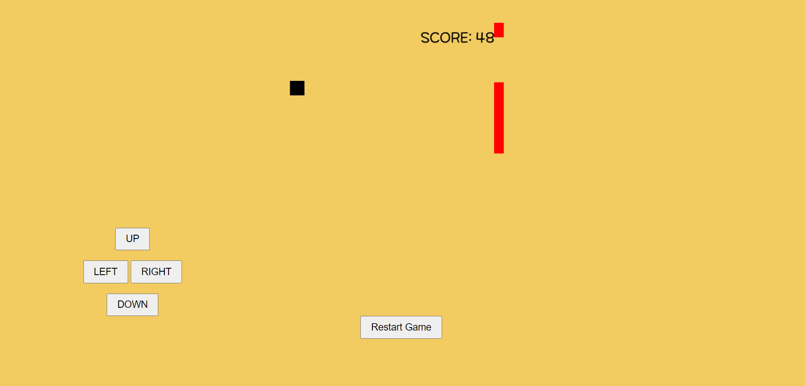

# 장애물 피하기 게임

게임의 목표는 플레이어 캐릭터를 조작하여 장애물을 피하고 가능한 한 오래 살아남아 점수를 높이는 것입니다. 사용자는 화면의 UP, DOWN, LEFT, RIGHT 버튼을 사용하여 플레이어 캐릭터를 조종할 수 있습니다. 장애물과 충돌하지 않도록 주의해야 합니다. 게임의 난이도는 시간이 지남에 따라 높아지며, 플레이어는 가능한 한 오래 살아남기 위해 적절한 움직임을 선택해야 합니다.

