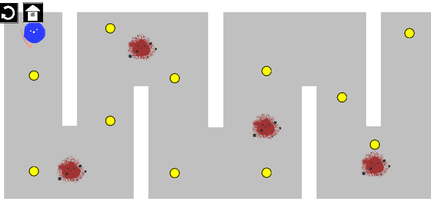

# og

프로그램 원본 파일

파란 네모(Player)가 빨간 동그라미(Enemy)를 피해 노란 동그라미(Item)을 획득하는 식의 게임

출처 : https://doggie-development.tistory.com/category/%EC%9C%A0%EB%8B%88%ED%8B%B0%20%EA%B0%95%EC%A2%8C/%EC%9C%A0%EB%8B%88%ED%8B%B0%20%EA%B8%B0%EC%B4%88%20%EA%B0%95%EC%A2%8C%20%282D%29

# upgrade

프로그램 응용 파일

기존의 게임 형식에서 메인 화면, 음악, 옵션, 게임 종료, 스테이지 형식, 클리어 화면, 아바타, 적의 움직임, 뒤로가기 기능 구현

: 메인 화면

: 옵션 팝업

: 종료 팝업

: 스테이지 선택 화면

: stage1

: stage2

: stage3

: 클리어 화면

