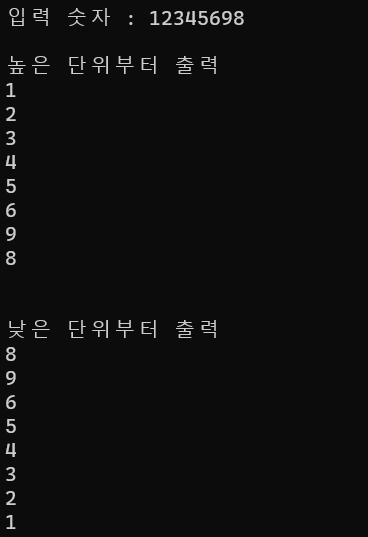
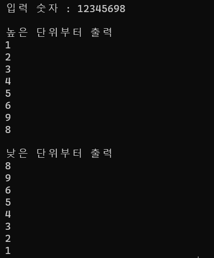
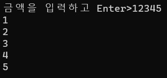
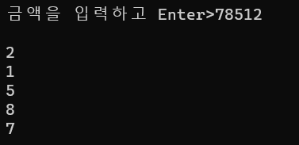
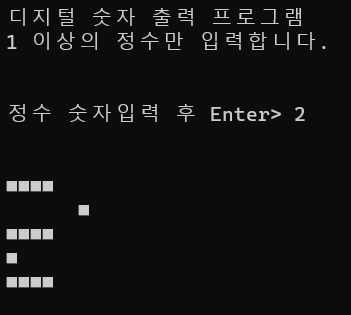
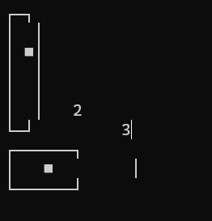
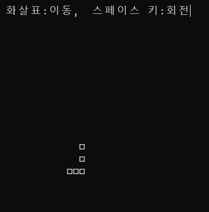

## numberpre01.c - 높은 단위 낮은 단위 출력 프로그램
### 반복문 사용

## numberpre02.c - 높은 단위 낮은 단위 출력 프로그램

## printoneline.c - 입력받은 숫자를 한 줄 출력 프로그램

## printoneline2.c - 입력받은 숫자를 역순으로 한 줄 출력 프로그램

## digitalnum.c - 입력받은 숫자를 디지털 숫자로 출력

## slidebar.c - 입력받은 숫자의 크기만큼 수직-수평 슬라이드 바 생성

## tetrisbasic.c - 테트로미노 하나를 회전, 이동

